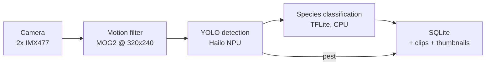
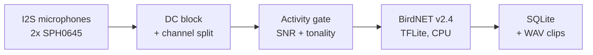
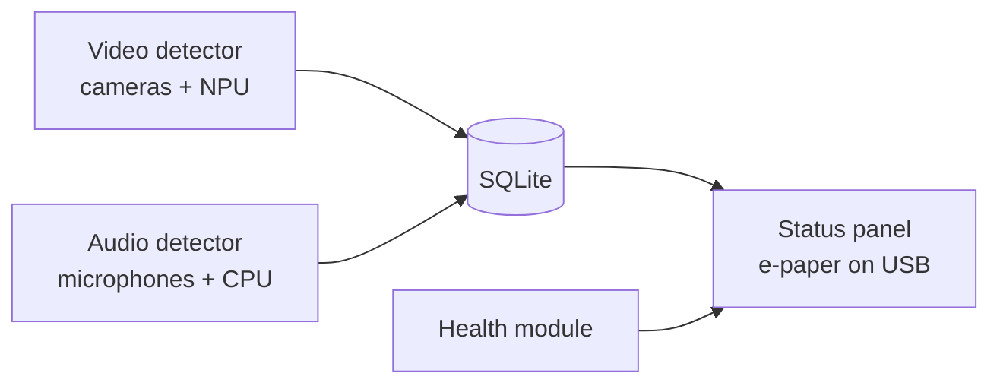

# RatCatcher AI

Wildlife detection system for bird feeders. The system identifies birds
to Genus and Species from the cameras *and* from the microphones. It also detects pest
animals (squirrels, rats, cats) in real-time on a Raspberry Pi 5.

## How It Works

Two cameras look at the bird feeders continuously. When the system
detects movement, a YOLO object detector on a Hailo-8L NPU classifies
the visitor as a bird or as a pest. The detector operates at
approximately 35 FPS. Birds then go to a MobileNet V2 species
classifier, which identifies the species from 965 known birds. The
taxonomy maps 50 Western US feeder species by name. The system writes
all detections to SQLite with thumbnails and optional video clips.



Two I2S microphones listen at the same time and identify bird song with
BirdNET. Audio is an **isolated detector**, and not a stage of the
video pipeline. It has its own capture thread and its own inference
thread, and it connects to the video path only at the database. Song
identification continues to operate when the cameras or the NPU are not
available. The video path continues to operate when the microphones are
not available.



The `detections_all` SQL view unions the two modalities behind a
`modality` column. Thus "what species were here today" continues to be
a single query.

An optional e-paper panel on USB answers that query with no terminal.
It shows the counts of today, divided into what the cameras saw and
what the microphones heard. It also shows the condition of the system.

```
+-------------------------------------------+
| RatCatcher today               14:32  RUN |
| ----------------------------------------- |
|                   EYE     EAR     ALL     |
|  BIRDS             18       6      24     |
|  RODENTS            3       0       3     |
|  OTHER              1       0       1     |
| ----------------------------------------- |
| Last  Dark-eyed Junco          ear  14:29 |
| CAM 2  NPU ok  MIC on  47C  disk 61%  3d  |
+-------------------------------------------+
```

The panel is a third **isolated consumer**, with the video detector
and the audio detector. It reads SQLite and the health module, and it
writes to a serial port. It shares nothing else. The panel reports on
the system. Thus a panel fault must not stop the system.



## Hardware

| Component | Model | Purpose |
|---|---|---|
| Computer | Raspberry Pi 5 (4GB) | Main controller |
| Cameras | 2x Arducam UC-517 B0270 | IMX477 12MP, IR-Cut for day and night |
| AI Accelerator | Hailo-8L AI HAT+ (13 TOPS) | Real-time object detection |
| Microphones | 2x Adafruit 3421 (SPH0645LM4H) | I2S MEMS, bird song capture, shared bus |
| Status display | Elecrow CrowPanel ESP32 2.13" e-paper | Counts and health, through USB |
| Power | UPS HAT + solar panel | Continuous outdoor power |
| Enclosure | IP65 weatherproof | Outdoor deployment |

## Quick Start (Development)

Development uses an x86-64 Linux workstation, and production uses the
Raspberry Pi 5. The camera layer and the audio layer use file sources
when the host has no attached hardware. Thus most work is possible on the
workstation. Refer to Platform Support below.

```bash
# Clone and install
git clone <repo-url> && cd RatCatcher_AI
python3 -m venv venv
venv/bin/pip install -e ".[dev,display,audio]"

# Run the tests (227 tests, no test doubles -- true WAVs, true SQLite)
venv/bin/pytest tests/ -v

# Show the system data
venv/bin/ratcatcher health

# Run the pipeline on a video file (OpenCV DNN backend, CPU)
venv/bin/ratcatcher run --source file --input path/to/video.mp4

# Show the detection statistics
venv/bin/ratcatcher stats --last 24h
```

## Quick Start (Raspberry Pi 5)

```bash
# Initial setup (installs system packages, makes the venv, sets up the cameras)
sudo ./scripts/setup_rpi.sh

# Install the Hailo AI HAT+ drivers
sudo ./scripts/install_hailo.sh

# Enable the I2S microphones (changes config.txt; a reboot is necessary)
sudo ./scripts/enable_i2s_mics.sh
sudo reboot

# Make sure that the two microphones give a signal
ratcatcher test-mic

# Download the ML models (this includes BirdNET from Zenodo)
./scripts/download_models.sh

# Copy the config
cp config/default.yaml /opt/ratcatcher/config/

# Start the service
sudo systemctl start ratcatcher
sudo journalctl -u ratcatcher -f
```

## CLI Commands

```
ratcatcher run                     # Start the full detection pipeline
ratcatcher run --mode motion       # Motion detection only (no AI)
ratcatcher run --mode detect       # Detection with no species ID
ratcatcher run --cameras 0         # Use camera 0 only
ratcatcher run --source file --input video.mp4  # Process a video file
ratcatcher run --backend opencv_dnn # Force the CPU detection backend

ratcatcher stats                   # Show the all-time detection counts
ratcatcher stats --last 24h        # Last 24 hours
ratcatcher stats --last 7d         # Last 7 days

ratcatcher health                  # System health check

ratcatcher run --audio             # Force bird song detection on
ratcatcher run --no-audio          # Force it off, whatever the config says

ratcatcher test-camera             # Capture and save a test frame
ratcatcher test-camera --camera 1  # Test camera 1

ratcatcher test-mic                # Record 5 s, report the level of each channel
ratcatcher test-mic --seconds 30   # A longer recording
ratcatcher test-mic --output a.wav # Save the recording
ratcatcher test-mic --identify     # Also run BirdNET on the recording

ratcatcher run --display           # Force the e-paper status panel on
ratcatcher run --no-display        # Force it off, whatever the config says

ratcatcher display --preview       # Print the screen as text, no hardware
ratcatcher display --list-ports    # List the serial ports to examine
ratcatcher display --once          # Send one frame and stop
ratcatcher display                 # Drive the panel until Ctrl-C
ratcatcher display --port /dev/ttyUSB0   # Give the port, do not examine each one
```

Use `display --preview` first when the screen is incorrect. It builds
the same frame that the host sends, and prints it. It opens no serial
port. If the preview is correct and the panel is not, the fault is in
the link or in the firmware.

Note that `test-mic --identify` does not use the activity gate. It
reports the raw BirdNET output. Thus it gives species names for room
noise. The live pipeline uses the gate first.

## ML Models

### Object Detection (Stage 1)
- **Model:** YOLOv8n custom-trained on Open Images V7 (11.7 MB ONNX)
- **File:** `models/ratcatcher_best.onnx`
- **Backends:** Hailo-8L NPU (production), NCNN (CPU fallback), OpenCV DNN (universal fallback)
- **Classes:** bird, squirrel, rat, cat, unknown_animal
- **Trained metrics:** mAP@0.5 = 0.751 (squirrel 0.957, cat 0.896, rat 0.762, bird 0.608)
- **Performance:** ~35 FPS for each camera on the Hailo-8L. Approximately 9-15 FPS on the CPU

### Species Classification (Stage 2)
- **Model:** MobileNet V2 iNaturalist Bird Classifier (INT8 quantized)
- **File:** `models/mobilenet_v2_inat_bird_quant.tflite` (3.6 MB)
- **Species:** 965 bird species (the taxonomy maps 50 Western US feeder species by name)
- **Input:** 224x224 RGB
- **Performance:** ~25-50 ms for each crop on the RPi5 CPU

### Bird Song Identification (Audio, independent)
- **Model:** BirdNET v2.4 (TFLite FP32)
- **File:** `models/BirdNET_v2.4_audio-model.tflite` (52 MB)
- **Classes:** 6522, global coverage. This includes non-bird labels (Dog, Engine, Human)
- **Input:** 3-second windows of 48 kHz audio
- **Performance:** 62 ms for each window on the RPi5 CPU -- approximately
  48x realtime, and approximately 4% of one core for two channels that
  operate continuously

**Licence note:** the BirdNET weights are **CC BY-NC-SA 4.0, not
GPL-3.** `scripts/download_models.sh` downloads them from Zenodo. This
repository does not contain them. Read the terms before commercial use.

## Project Structure

```
config/
  default.yaml              System-wide configuration
  species.yaml              50 Western US bird species + 9 pest species

src/ratcatcher/
  cli.py                    CLI entry point (run/stats/health/test-mic/test-camera)
  config.py                 YAML config loading with frozen dataclasses
  camera/                   Camera abstraction (Picamera2, file, webcam)
  motion/                   MOG2 motion detection + ROI masking
  detection/                YOLO object detection (3 backends)
  classification/           MobileNet V2 species classification (TFLite)
  audio/                    I2S capture, conditioning, activity gate, BirdNET
  display/                  E-paper status panel over USB serial
  pipeline/                 Threaded engines (video and audio)
  storage/                  SQLite logging, FFmpeg clips, thumbnails
  monitoring/               System health + detection statistics

firmware/                   ESP32-S3 firmware for the CrowPanel display
models/                     ML model files (.tflite, .onnx, .hef)
training/                   CUDA training pipeline (download, train, export)
scripts/                    RPi5 setup, model download, firmware build
systemd/                    Systemd service for auto-start
tests/                      227 tests (pytest, no test doubles)
docs/                       Architecture and deployment docs
```

## Training Your Own Detector

Train a custom YOLOv8n on a desktop GPU to make pest detection better:

```bash
# Install the training dependencies (different from the RPi deployment)
pip install torch torchvision --index-url https://download.pytorch.org/whl/cu121
pip install -r training/requirements.txt

# Download the training data from Open Images V7 (~11K images)
python training/download_data.py --output datasets/ratcatcher --max-per-class 3000

# Train (~2.5 hours on an RTX 5090)
python training/train_detector.py --data datasets/ratcatcher/dataset.yaml --epochs 100

# Export to ONNX for the RPi
python training/export_model.py --weights runs/train/ratcatcher/weights/best.pt
```

Refer to `training/README.md` for the full procedure.

## Configuration

All parameters are in YAML files in `config/`. To change the config
directory, set the `RATCATCHER_CONFIG_DIR` environment variable.

Key parameters in `config/default.yaml`:
- Camera resolution, FPS, and source type
- Motion detection sensitivity and cooldown
- Detection backend and confidence thresholds
- Species classifier model path and minimum confidence
- Clip seconds before and after the event, and disk retention
- Alert classes and notification methods
- Audio: ALSA device, activity gate thresholds, BirdNET confidence

Bird song detection is **off by default** (`audio.enabled: false`). Set
it on when `ratcatcher test-mic` reports OK on the two channels.

## 50 Target Species (Western US)

Jays, chickadees, nuthatches, woodpeckers, hummingbirds, finches,
sparrows, towhees, doves, thrushes, warblers, hawks, and more. Refer to
`config/species.yaml` for the full list with Genus, Species, Family,
and model label indices.

Pest detection: Western Gray Squirrel, Fox Squirrel, California Ground
Squirrel, Norway Rat, Roof Rat, House Mouse, Raccoon, Opossum, Cat.

## Platform Support

| Platform | Camera | Detection | Classification | Audio |
|---|---|---|---|---|
| RPi5, production | Picamera2 | Hailo-8L NPU | ai-edge-litert | ALSA / I2S mics |
| RPi5, no Hailo | Picamera2 | NCNN (CPU) | ai-edge-litert | ALSA / I2S mics |
| Linux x86-64, development | FileSource / Webcam | OpenCV DNN | ai-edge-litert | WAV file source |

The Raspberry Pi 5 has Python 3.13, and the x86-64 workstation has
Python 3.14. Each host has its own `venv/`.

Factory patterns in the camera layer, the detection layer and the audio
layer select a backend at startup. Thus a device that is not available
becomes a file source, and the system does not stop.

`tflite-runtime` publishes no wheels for Python 3.13 and subsequent
versions. The `audio` extra installs `ai-edge-litert`, its supported
successor. The two classifiers try this sequence: `tflite_runtime`,
`ai_edge_litert`, `tensorflow`.

## License

GPL-3.0-or-later. Refer to `LICENSE`.

That licence does **not** apply to the BirdNET model weights. They are
CC BY-NC-SA 4.0, and the code gets them at runtime.
