# Architecture -- RatCatcher AI

## System Overview

RatCatcher AI is a real-time wildlife detection system for outdoor bird
feeders. It runs on a Raspberry Pi 5 with two cameras and a Hailo-8L AI
accelerator. It detects pest animals, and it identifies bird species by
Genus and Species.

The system has two isolated detectors. The **video pipeline** does
motion detection, then object detection, then species classification.
The **audio pipeline** does an activity gate, then song identification.
The two share the SQLite database and nothing else: no queues, no
locks, no shared state. Thus each one continues to operate when the
hardware of the other is not available.

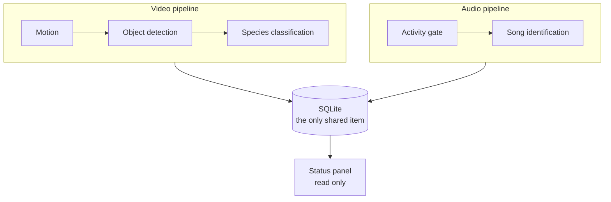

## Pipeline Architecture

The system uses a three-stage pipeline with a motion pre-filter:

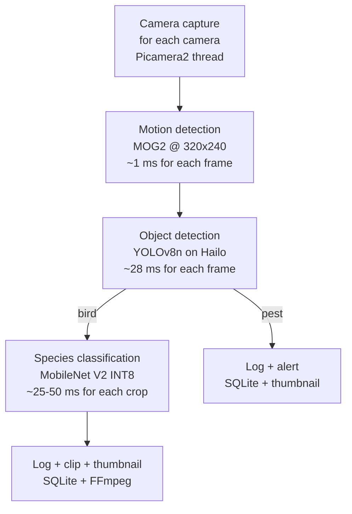

### Stage 0: Motion Pre-filter

This stage runs on each frame at a low resolution (320x240). It uses
OpenCV MOG2 background subtraction. A frame with no motion does no
neural network inference. This saves approximately 90% of the processor
time, because most frames contain no animal.

Key parameters:
- Resolution: 320x240 (not related to the camera resolution)
- Morphological cleanup: erode (3x3), then dilate (7x7)
- Minimum contour area: 0.5% of the frame area
- Grid cooldown (8x6 cells, 2 s default) prevents a duplicate detection
- Optional ROI polygon mask limits the detection zones

### Stage 1: Object Detection (YOLO)

This stage runs only on the frames that have motion. YOLOv8n puts the
objects it finds into five categories:

| Class | ID | Description |
|---|---|---|
| bird | 0 | All birds (these go to Stage 2) |
| squirrel | 1 | Squirrel species |
| rat | 2 | Rats, mice |
| cat | 3 | Domestic cats |
| unknown_animal | 4 | Other animals |

Three backends do the same work:

| Backend | Hardware | Performance | Use |
|---|---|---|---|
| HailoDetector | Hailo-8L NPU | ~35 FPS for each camera | Production (RPi5) |
| NCNNDetector | ARM CPU | ~12 FPS | RPi5 with no Hailo |
| OpenCVDetector | All CPUs | ~4-8 FPS | Development (Linux x86-64) |

The factory in `detection/factory.py` selects the best available
backend at startup.

**Custom-trained model:** `models/ratcatcher_best.onnx` (11.7 MB)
gives the five classes directly. The backends find this condition from the shape of the output
tensor (9 values for each detection = 5 classes + 4 box coordinates).
No COCO remap is necessary.

**COCO fallback:** with COCO-pretrained weights, the backends use
`map_coco_class()` to remap the COCO IDs (bird=14, cat=15, other
animals=unknown_animal). COCO has no squirrel class and no rat class.

### Stage 2: Species Classification

This stage runs only when Stage 1 finds a bird. It crops the bird area
from the full-resolution frame and classifies the crop.

- **Model:** MobileNet V2 iNaturalist Bird Classifier
- **Format:** TFLite INT8 quantized (3.6 MB)
- **Species:** 965 bird species. The taxonomy holds 50 Western US feeder species
- **Input:** 224x224 RGB
- **Output:** softmax on 965 classes
- **Threshold:** a prediction below 70% confidence becomes unknown

The taxonomy maps the model output indices to the species data (Genus,
Species, Common Name, Family). A species that is not in the taxonomy
shows as "unknown_NNN".

## Audio Pipeline (Isolated Detector)

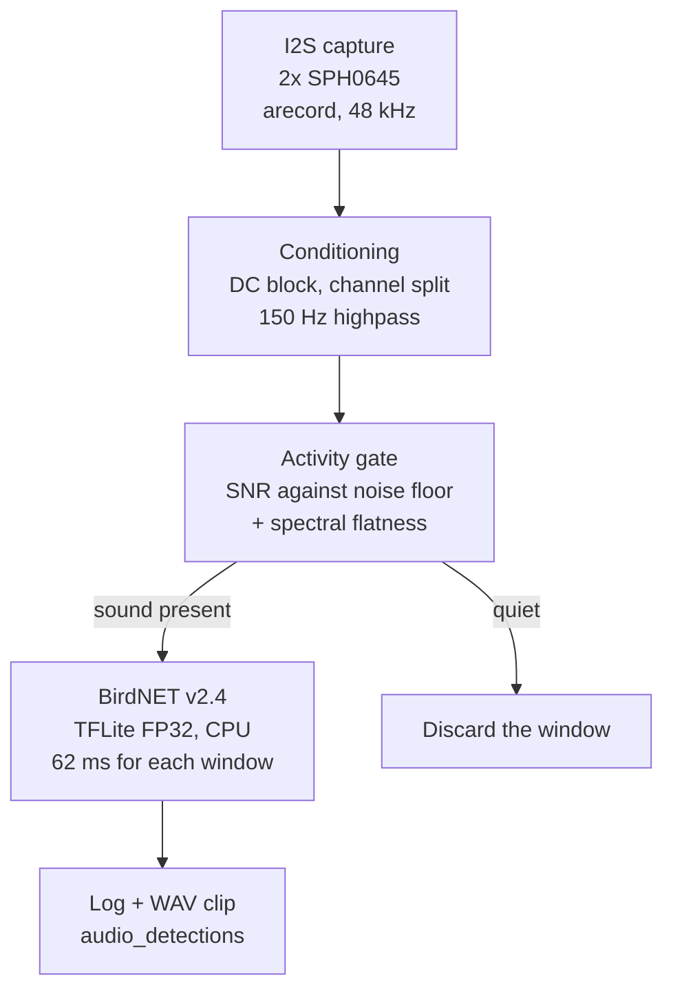

### Capture

Two Adafruit SPH0645 I2S MEMS microphones share one I2S bus. Their SEL
pin divides them. Thus ALSA shows them as a single stereo device:
channel 0 is the left microphone (SEL to GND), and channel 1 is the
right microphone (SEL to 3V3). `ArecordSource` runs `arecord` as a
subprocess and reads S32_LE frames. `WavFileSource` uses a recording
for development.

The `AudioSource` protocol gives `is_realtime`, and the consumer
selects its backpressure policy from that value. A live device must
discard windows when the consumer is too slow, because a blocked reader
stops the sound card and causes ALSA overruns. A file must wait,
because it gives data much faster than realtime, and a discard loses
part of the recording with no message. The property is on the producer,
because only the producer knows if a delay is recoverable.

### Conditioning

The SPH0645 has no output coupling capacitor. Thus each sample has a
large constant bias. On this build the bias measures approximately
-0.044 of full scale. If the pipeline does not remove that bias, the
bias controls each energy measurement downstream. The DC removal is
vectorised on the block, and does not loop on each sample. The data
comes as 18 bits, left-justified in a 32-bit slot.

### Activity Gate

The gate is the audio analogue of the motion pre-filter, but it is much
more permissive, because the economics are different. Motion detection
prevents a ~28 ms NPU inference, and it discards most frames. The gate
prevents a 62 ms CPU inference. That inference costs approximately 4%
of one core for two channels that operate continuously. Thus there is
almost nothing to save if the gate discards a window, and the cost is
high if the gate discards a bird.

The gate operates on each channel independently, because the two
microphones have different ambient sound. It also operates on each
frame, and not on the full window, because full-window flatness
discarded the warbles of birds.

Measured against a field soundscape, with the BirdNET output as ground
truth, a 2 dB SNR margin keeps 100% of the windows that contain a bird.
A 4 dB margin discards 14%, and a 6 dB margin discards 48%. The gate is
of use on quiet nights and in continuous rain. It is of no use in a
dawn chorus, because there is no quiet baseline for the measurement:
the birds *are* the ambient sound.

### Identification

BirdNET v2.4, TFLite FP32, 52 MB, on the CPU. The classifier reads its
window length and its class count from the model file at load time. It
does not hardcode them. The detection backends use the same method to
find a custom model against a COCO model.

The coverage is global (6522 classes) and includes non-bird labels
(Engine, Dog, Human). It does not cover only the ~50 Western US species
in `config/species.yaml`. The system does not use the BirdNET
location/date meta-model, which could decrease the number of candidates
by geography and season.

## Threading Model

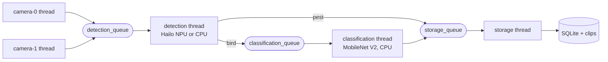

Each camera runs in its own thread and puts frames into a shared
detection queue. The detection thread processes one frame at a time, on
the Hailo NPU or on the CPU. A bird detection goes to the
classification queue. A pest detection goes directly to storage. The
storage thread writes to SQLite and makes the thumbnails.

All queues have a limit (64-256 items). When a queue is full, the code
discards the frame and increases a counter. This prevents memory
exhaustion at a high load, and keeps the real-time response.

The shutdown uses a sentinel object. The shutdown sequence puts a
sentinel on each queue, and each worker thread stops when it reads that
sentinel.

The audio engine adds its own two threads. They share only the database
with the threads above:

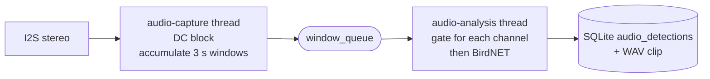

The shutdown of `arecord` needs one step in sequence: the code must
close the read end of its stdout pipe *before* it sends the signal. If
the consumer stops first, arecord stays blocked on a write into a full
pipe, and it does not get to its SIGTERM handler. Then `terminate()` waits
the full timeout, and SIGKILL becomes necessary. If the code closes the
pipe first, arecord gets EPIPE and stops immediately.

The display engine adds one more thread. It shares less, because it
only reads.

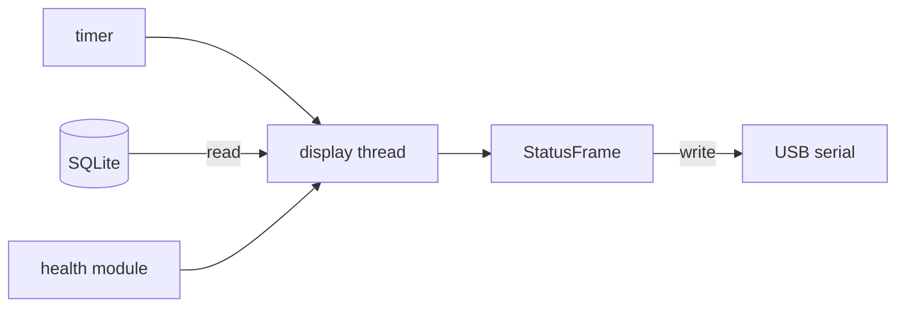

Note the direction. The pipeline pushes nothing to the panel. The panel
pulls on a timer. Only `set_state` goes in the other direction: it is
a string with a lock, which the pipeline writes so that the header can
show RUN, WARN or STOP.

That one value is the limit. Thus no pipeline thread can wait for the
panel. This is important, because the panel is the part that reports on
the system: a display fault that could stop the detection is the worst
possible failure mode.

Two rules control when the host writes to the panel. The two rules are
about the hardware, and not about the data. First, the host does not
send a frame that is the same as the frame on the screen. Each refresh
costs power and part of the life of the panel. Second, the host
forces a full refresh at intervals, because a partial refresh keeps a
ghost of the previous image, and the ghosts increase.

`refresh_now()` is public, and the background thread operates on its
own schedule. Thus the two can enter the update path. A lock protects
it: with no lock, the two calls contend on the serial read, and each
one takes the bytes that the other was about to read.

## Data Storage

### SQLite Database

WAL journal mode gives concurrent read and write. Schema:

```sql
detections (
    id, timestamp, camera_id, stage,
    class_name, species, common_name, confidence,
    bbox_x, bbox_y, bbox_w, bbox_h,
    clip_path, thumbnail_path,
    frame_width, frame_height, metadata
)
```

Indexed on timestamp, species, and camera_id. The metadata column holds
JSON, for example the top-K classification results.

The audio identifications are in a different table:

```sql
audio_detections (
    id, timestamp, channel,
    species, common_name, confidence,
    duration_seconds,
    band_rms_dbfs, spectral_flatness, peak_frequency_hz,
    clip_path, metadata
)
```

Indexed on timestamp, species, and channel. This table stays apart from
`detections`. An audio event has no frame, no bounding box and no
camera, but it does have a channel, a duration and acoustic
measurements. One combined table would give a wide row that is mostly
NULL for each modality. It would also make a relaxed NOT NULL
constraint on `camera_id` necessary.

A view gives the unified query surface with none of that cost:

```sql
CREATE VIEW detections_all AS
    SELECT 'video' AS modality, id, timestamp, camera_id AS source_id,
           class_name, species, common_name, confidence, clip_path
    FROM detections
  UNION ALL
    SELECT 'audio' AS modality, id, timestamp, channel AS source_id,
           'bird' AS class_name, species, common_name, confidence, clip_path
    FROM audio_detections;
```

`source_id` is the camera for a video row, and the microphone channel
for an audio row. Note that the system logs the two modalities
independently and does **not** correlate them. If the system sees and
hears one bird at the same moment, it writes two rows with no link.

### Audio Clips

WAV, written with the Python standard library and not with FFmpeg. Thus
the audio path has no external encoder dependency.

### Video Clips

Optional H.264 MP4 clips around a detection event:
- Buffer before the event: 5 seconds (a ring buffer of recent frames)
- Recording after the event: 10 seconds
- Encoder: FFmpeg through a subprocess pipe (raw frames to H.264)

### Thumbnails

JPEG images with a bounding box on top, resized to 320 px on the
longest edge. One thumbnail for each detection event.

### Retention

Automatic cleanup policy:
- Delete a clip or a thumbnail after 30 days (configurable)
- Keep the disk use below a maximum (10 GB default)
- Delete the oldest files first when the use is above the limit

## Configuration Architecture

All configuration is YAML. The code loads it into frozen dataclasses at
startup.

```
config/
  default.yaml     All parameters, with defaults
  species.yaml     Species taxonomy + model label index mapping
```

The configuration hierarchy:

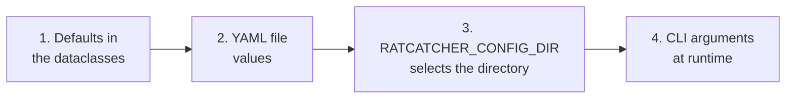

Each step wins against the step before it.

## Platform Abstraction

Four factory patterns give the cross-platform support.

### Camera Factory (camera/platform_camera.py)

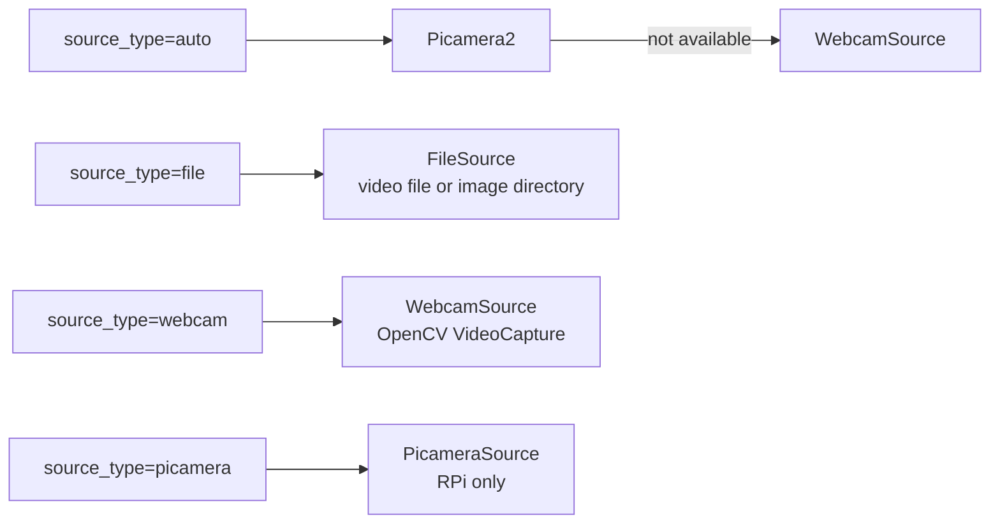

### Detection Factory (detection/factory.py)

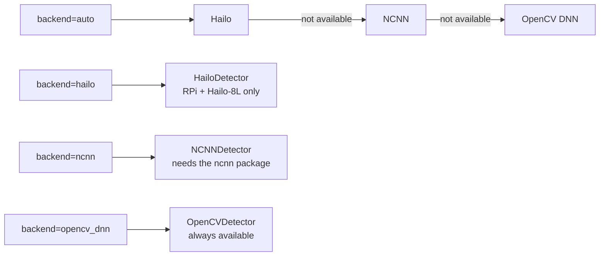

### Audio Factory (audio/factory.py)

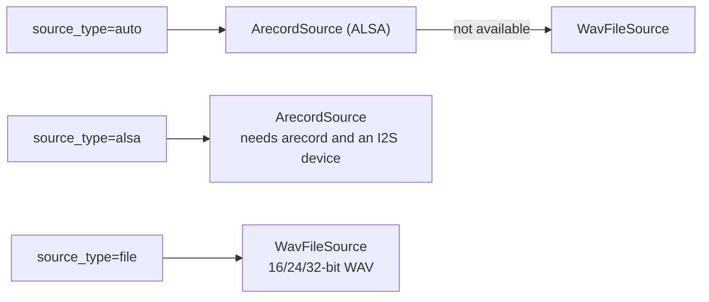

### Display Factory (display/factory.py)

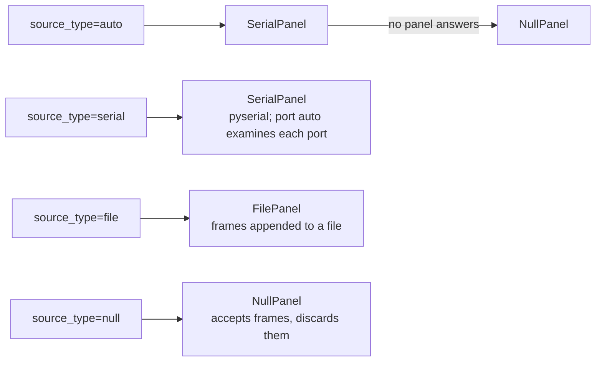

This factory is the only one with an "auto" path that always succeeds.
The other three stop with an error, because a camera or a detector that
is not available means the system cannot do its work. A panel that is not
available means only that no person sees the summary. Thus the display
factory uses a null panel, and the pipeline continues.

Port detection is also the only one that needs a handshake and not an
identifier. The CrowPanel shows a plain CH340 descriptor
(`1a86:7522`). Many other development boards show the same descriptor.
Thus the factory sends a ping to each candidate port, and keeps the one
that answers with a `hello`. The factory examines only the known USB
serial bridges. It writes a byte to each port that it opens, and the
machine can have serial devices that belong to something else.

All four factories use lazy imports. Thus a backend that is not
available causes no import error.

## Training Pipeline (Desktop CUDA)

The `training/` directory has a self-contained pipeline. It trains a
custom detection model on a desktop GPU.

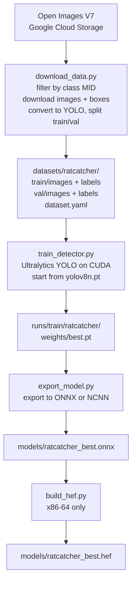

**Data sources:** Open Images V7, with direct HTTP downloads from S3.
No API keys, and no large dependencies. A class MID code and the
quality flags filter the images (this excludes groups, depictions and
occluded objects).

**Training:** Ultralytics YOLOv8 with PyTorch CUDA. 100 epochs, a stop
when the result does not get better, and mosaic augmentation. Result: mAP@0.5 = 0.751 on ~10K images
across 5 classes.

**Custom model detection:** the backends find a 5-class model
automatically. They examine the output tensor shape at load time
(OpenCV DNN) or at inference time (NCNN, Hailo). If the output has 9
values for each detection (4 box + 5 class scores), the code does no
COCO remap.

## Memory Budget (4GB RPi5)

| Component | Estimated RAM |
|---|---|
| OS (headless) | ~300 MB |
| Python + OpenCV + Picamera2 | ~300 MB |
| YOLO model (Hailo/NCNN) | ~200 MB |
| Species classifier (TFLite INT8) | ~50 MB |
| BirdNET (TFLite FP32, 52 MB weights) | ~156 MB (measured) |
| Frame buffers (2 cameras) | ~200 MB |
| Audio window buffers (2 channels) | ~10 MB |
| SQLite + Python | ~150 MB |
| **Total** | **~1.4 GB** |

Approximately 2.6 GB stays free on a 4 GB headless system. BirdNET is
the largest model file in the system, because it is FP32 and the two
vision models are quantized.

## Deployment

### Systemd Service
- Auto-start at boot with `ratcatcher.service`
- Restart after a failure (10 s delay)
- Watchdog timer (60 s)
- Memory limit: 3 GB (this prevents an OOM kill of other services)
- Security: NoNewPrivileges, ProtectSystem=strict

### Outdoor Considerations
- IR-Cut cameras for day and night operation
- UPS HAT for power failures
- IP65 enclosure with Gore-Tex vents
- An active cooler (the RPi5 throttles at 80 C)
- A scheduled reboot each night, to prevent long-term problems
