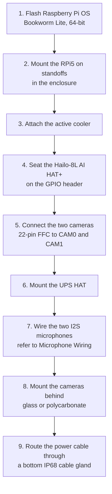
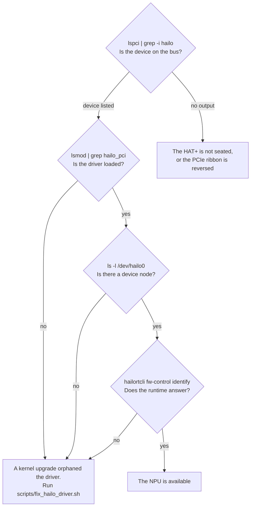

# Deployment Guide -- RatCatcher AI

## Hardware Assembly

### Components

| Component | Part Number | Notes |
|---|---|---|
| Raspberry Pi 5 (4GB) | | 8GB is also satisfactory |
| Arducam UC-517 B0270 (x2) | B0270 | The IR-Cut type, for day and night |
| Hailo-8L AI HAT+ | SC1166 | 13 TOPS, on the GPIO header |
| Adafruit I2S MEMS Microphone Breakout (x2) | 3421 | SPH0645LM4H, shared I2S bus |
| Elecrow CrowPanel ESP32 2.13" e-paper | | Optional status display, USB-C |
| UPS HAT | | Model-specific, refer below |
| MicroSD 64GB or more | | A2 rated is better |
| 22-pin FFC ribbon cables (x2) | | The RPi5 uses 22-pin, not 15-pin |
| IP65 enclosure | | With cable glands |
| Active cooler for the RPi5 | | Necessary for a continuous load |
| 5V/5A USB-C power supply | | The official RPi5 PSU is better |

### Assembly Order



### Camera Mounting

- Put the cameras at different angles to the feeder
- Mount them behind optical glass or UV-resistant polycarbonate
- Apply a hydrophobic coating to the outer surface of the window
- Install a rain hood to keep water off the lens window
- Angle them down (15-30 degrees) for the best feeder coverage

### Microphone Wiring

The two microphones share one I2S bus. SEL is the only difference in
the wiring. SEL selects which half of the stereo frame each microphone
drives.

| SPH0645 pin | Pi 5 header | Notes |
|---|---|---|
| 3V | pin 1 (3V3) | Do not use 5V |
| GND | pin 6 (GND) | Common ground for the two microphones |
| BCLK | pin 12 (GPIO18) | Shared by the two microphones |
| LRCL / WS | pin 35 (GPIO19) | Shared by the two microphones |
| DOUT | pin 38 (GPIO20) | Shared. The microphones use different slots |
| SEL | GND or 3V3 | Mic A: GND (left). Mic B: 3V3 (right) |

If the two SEL pins go to the same rail, the two microphones use the
same time slot. Then they contend on the shared DOUT line and give one
unusable signal. DOUT and the 3V3 rail are *shared*. Thus one fault
there makes the two channels silent at the same time. Refer to
Troubleshooting.

Mount the microphones with the port in the direction of the feeder, behind a
windscreen, and away from direct rain. They are MEMS parts with an open
port. Water on that port destroys them.

## Software Setup

### Step 1: Initial OS Setup

After you flash the card, enable SSH and set up WiFi:

```bash
# On the SD card (boot partition)
touch ssh
# Make a wpa_supplicant.conf file with your WiFi credentials

# Or use the Raspberry Pi Imager to set up SSH and WiFi first
```

Connect with SSH to the Pi, then run:

```bash
sudo raspi-config
# Set the hostname, the locale and the timezone
# Enable I2C (for the UPS HAT monitor)
# Expand the filesystem
```

### Step 2: Install RatCatcher AI

```bash
# Clone the repository
git clone <repo-url> ~/RatCatcher_AI
cd ~/RatCatcher_AI

# Run the setup script (installs packages, makes the venv, sets up the cameras)
sudo ./scripts/setup_rpi.sh
```

This script does these tasks:
- Installs the system packages (Python, OpenCV, FFmpeg, libcamera, Picamera2)
- Makes the `ratcatcher` system user, in the video, i2c and gpio groups
- Makes `/opt/ratcatcher/` with the data directories
- Makes a Python venv and installs the project
- Sets up `/boot/firmware/config.txt` for the IMX477 cameras
- Installs the systemd service

### Step 3: Enable the I2S Microphones

```bash
sudo ./scripts/enable_i2s_mics.sh
sudo reboot
```

The script makes a backup of `/boot/firmware/config.txt`. It then
enables `dtparam=i2s=on` and `dtoverlay=googlevoicehat-soundcard`, and
makes sure that the overlay is there. A reboot is necessary: the
firmware reads the device tree overlays at boot, and you cannot apply
them to a kernel that runs.

After the reboot, make sure that the card is there:

```bash
arecord -l
# This must list card 0: snd_rpi_googlevoicehat_soundcard
```

### Step 4: Install the Hailo Drivers

```bash
sudo ./scripts/install_hailo.sh
sudo reboot
```

After the reboot, make sure that the device answers:

```bash
hailortcli fw-control identify
# This must show the Hailo-8L device data
```

### Step 5: Download the Models

```bash
source /opt/ratcatcher/.venv/bin/activate
./scripts/download_models.sh /opt/ratcatcher/models
```

Copy the models to the RPi:

```bash
# Custom-trained YOLO detector (11.7 MB, 5 classes)
cp models/ratcatcher_best.onnx /opt/ratcatcher/models/

# Species classifier (3.6 MB, 965 bird species)
cp models/mobilenet_v2_inat_bird_quant.tflite /opt/ratcatcher/models/
cp models/inat_bird_labels.txt /opt/ratcatcher/models/
```

`download_models.sh` also gets BirdNET v2.4 (52 MB) from Zenodo, and
makes sure that the TFL3 magic bytes are correct. Those weights are
**CC BY-NC-SA 4.0, not GPL-3**. This is why the script downloads them
and the repository does not contain them. Read the terms before
commercial use.

`training/train_detector.py` made the YOLO model from Open Images V7
data. To train it again with your own feeder images, refer to
`training/README.md`.

### Step 6: Configure

```bash
cp config/default.yaml /opt/ratcatcher/config/
cp config/species.yaml /opt/ratcatcher/config/
```

Change `/opt/ratcatcher/config/default.yaml` for your installation:
- Set the camera resolution and the FPS
- Set data_dir to `/opt/ratcatcher/data`
- Tune the motion detection sensitivity for your feeder location
- Set the retention days and the maximum disk use
- Set `audio.enabled: true` when test-mic reports OK on the two channels
- Set `display.enabled: true` when the panel has the RatCatcher firmware

### Step 6b: Flash the status panel (optional)

Do not do this step if you have no panel. The board ships with an
Elecrow demo that ignores the serial port. Thus you must flash it again
before it can show data.

```bash
# The account needs write access to the serial port. This is effective
# at the next login, so do it first.
sudo usermod -aG dialout $USER
# log out and log in again

# Find the panel
ratcatcher display --list-ports

# Build and flash. The first build downloads approximately 500 MB of
# ESP32 tools into firmware/.arduino/ and takes some minutes.
./scripts/build_panel_firmware.sh --upload --port /dev/ttyUSB0

# Make sure that the panel answers and draws
ratcatcher display --once
```

`--list-ports` shows only the ports with a known USB serial bridge.
Detection then must do a handshake on top of that. The CrowPanel shows a
plain CH340 descriptor, and many other boards show the same descriptor.
Thus the USB identifiers alone cannot find it. If the machine has other
serial devices that must stay closed, give the port in `display.port`
and do not use `auto`.

### Step 7: Test

```bash
source /opt/ratcatcher/.venv/bin/activate

# Make sure that the cameras operate
ratcatcher test-camera --camera 0
ratcatcher test-camera --camera 1

# Make sure that the microphones operate -- the two channels must report OK
ratcatcher test-mic

# Optional: make sure that BirdNET loads and runs on live audio
ratcatcher test-mic --seconds 30 --identify

# Make sure that the system is correct
ratcatcher health

# Test the pipeline for a short time
ratcatcher run --cameras 0
# Ctrl+C to stop
```

A correct `test-mic` run reports a DC offset that is not zero (the
SPH0645 always has one). It also reports an RMS in the -40s dBFS for
ordinary ambient sound:

```
  channel             RMS       peak   status
  0 (left )      -46.3      -19.1   OK
  1 (right)      -47.7      -13.1   OK
```

`--identify` does not use the activity gate. It reports the raw BirdNET
output. Thus it gives species names for room noise. This is correct
behaviour for that command, and it is not what the live pipeline does.

### Step 8: Start the Service

```bash
sudo systemctl start ratcatcher
sudo systemctl status ratcatcher
sudo journalctl -u ratcatcher -f
```

The service starts at boot, and it starts again after a failure.

## Monitoring

### View the Logs

```bash
sudo journalctl -u ratcatcher -f        # Live
sudo journalctl -u ratcatcher --since today  # The logs of today
```

### Detection Statistics

```bash
source /opt/ratcatcher/.venv/bin/activate
ratcatcher stats --last 24h
ratcatcher stats --last 7d
```

### System Health

```bash
ratcatcher health
# Shows: CPU temperature, memory, disk, Hailo status, TFLite, FFmpeg
```

### Query the Database

```bash
sqlite3 /opt/ratcatcher/data/detections.db

-- Recent detections
SELECT timestamp, camera_id, class_name, species, common_name, confidence
FROM detections ORDER BY timestamp DESC LIMIT 20;

-- Species counts today
SELECT species, common_name, COUNT(*) as count
FROM detections
WHERE timestamp >= date('now')
GROUP BY species
ORDER BY count DESC;

-- Pest detections
SELECT timestamp, class_name, confidence
FROM detections
WHERE class_name IN ('squirrel', 'rat', 'cat')
ORDER BY timestamp DESC;

-- Bird song identifications, and which microphone heard them
SELECT timestamp, channel, species, common_name, confidence
FROM audio_detections ORDER BY timestamp DESC LIMIT 20;

-- The two modalities together, through the unified view
SELECT modality, timestamp, source_id, species, common_name, confidence
FROM detections_all
WHERE timestamp >= date('now')
ORDER BY timestamp DESC;

-- Species seen AND heard today. The system logs them independently,
-- so this join is the only thing that correlates them.
SELECT species, common_name,
       SUM(modality = 'video') AS seen,
       SUM(modality = 'audio') AS heard
FROM detections_all
WHERE timestamp >= date('now') AND species IS NOT NULL
GROUP BY species ORDER BY seen + heard DESC;
```

## Outdoor Deployment Checklist

- [ ] The enclosure is IP65 rated, with sealed cable glands
- [ ] Install Gore-Tex vents, to prevent condensation
- [ ] Put desiccant bags in the enclosure
- [ ] The camera windows are optical glass (not acrylic, which becomes yellow)
- [ ] The microphone ports have windscreens and no direct rain
- [ ] `ratcatcher test-mic` reports OK on the two channels after assembly
- [ ] A hydrophobic coating is on the outer camera window
- [ ] All cables enter at the bottom (for water drainage)
- [ ] Install the active cooler on the RPi5
- [ ] Charge the UPS HAT and check it
- [ ] The solar panel gives ~12W continuously (a 50W panel minimum)
- [ ] The battery gives one day or more of autonomy (40Ah+ LiFePO4)
- [ ] Enable the watchdog timer in the systemd service
- [ ] Schedule a reboot each night with cron
- [ ] Set up remote SSH access
- [ ] Put the enclosure at a 15-30 degree angle, pointed down

## Troubleshooting

### The camera does not answer

```bash
# Check the camera connections
libcamera-hello --camera 0 --timeout 5000
libcamera-hello --camera 1 --timeout 5000

# Check config.txt
grep -i "imx477\|camera" /boot/firmware/config.txt
# This must show: camera_auto_detect=0 and dtoverlay=imx477
```

### The Hailo NPU does not answer

Start at the hardware and move up. The RatCatcher log tells you nothing
useful if the OS cannot see the device. Note also that the
`HAILO_STREAM_ABORT` lines in `hailort.log` are what an ordinary
shutdown writes. They are not an error.



**If step 1 succeeds and steps 2 to 4 do not, a kernel upgrade almost
certainly orphaned the driver.** To make sure, compare the kernel that
runs against the location of the module:

```bash
uname -r
find /lib/modules -name 'hailo_pci.ko*'
```

If the two paths give different kernel versions, that is the problem.
`hailort-pcie-driver` is dependent on `build-essential`, and not on
`dkms`. With no dkms, its postinst compiles a one-off module for the
kernel that ran at install time. Then the next kernel upgrade disables
the NPU with no message. Repair it, and make the rebuild automatic:

```bash
sudo ./scripts/fix_hailo_driver.sh
```

That script installs `dkms`, installs the driver again so that it goes
into the DKMS tree, loads the module, and checks each step. No reboot
is necessary.

Until the NPU is back, `backend: "auto"` uses the CPU and writes this
log line:

```
WARNING Auto-detect: Hailo NPU unavailable, falling back to CPU -- ...
```

Detection continues at approximately 5 FPS for each camera, and not 35.
If you see that line in the journal, the system is not using the NPU.

### Compile the custom detector for the NPU

The stock `yolov8n.hef` from the Model Zoo is COCO-80. It has no
squirrel class and no rat class. Thus with that file the detector can
report only bird and cat. You must compile the custom 5-class model to
a HEF, and **you cannot do that on the Pi**. The Hailo Dataflow
Compiler is an x86-64 Linux wheel (Python 3.8-3.11) with no aarch64
build.

On an x86-64 Ubuntu 20.04 or 22.04 machine:

```bash
# 1. Get the DFC (a free account is necessary) from
#    https://hailo.ai/developer-zone/software-downloads/
#    The DFC major version must agree with the HailoRT on the Pi (4.23).
python3 -m venv dfc-venv
./dfc-venv/bin/pip install hailo_dataflow_compiler-*.whl

# 2. Clone this repo, then copy the two gitignored inputs.
scp pi:RatCatcher_AI/models/ratcatcher_best.onnx models/
rsync -a pi:RatCatcher_AI/datasets/ datasets/     # or: python training/download_data.py

# 3. Build. Use the architecture that
#    'hailortcli fw-control identify' reports on the Pi. A hailo8l HEF
#    runs on a Hailo-8, but a hailo8 HEF will NOT load on a Hailo-8L.
PYTHON=./dfc-venv/bin/python HAILO_ARCH=hailo8l ./scripts/build_hef.sh
```

Copy the result back, and make sure that it is the custom model and not
COCO:

```bash
scp models/ratcatcher_best.hef pi:RatCatcher_AI/models/

# On the Pi -- this must say 5 classes, not 80:
hailortcli parse-hef models/ratcatcher_best.hef
```

No config change is necessary. `config/default.yaml` names
`ratcatcher_best.onnx`, and the factory changes the suffix to `.hef` on
the Hailo path. Thus the system uses the NPU at the next restart.

### The microphones are silent or defective

First, tell "no sound" from "no microphone". Record the raw samples and
examine them:

```bash
arecord -D hw:0,0 -c 2 -r 48000 -f S32_LE -d 3 /tmp/mic.wav
ratcatcher test-mic
```

A *constant* sample value in the full file means that there is no
microphone data. `0x00000001` on the left and `0xfffffffe` on the right
is a special condition: it is LRCLK that bleeds onto a GPIO20 that
nothing drives, and it is not audio. In the 64-bit frame, that pattern
is the word-select line, one bit clock late.

To make sure that nothing drives the data line, force an internal pull
on GPIO20 during a capture:

```bash
pinctrl set 20 pd   # then record; all-zero samples means nothing drives the line
pinctrl set 20 pu   # then record; all-ones means the same
pinctrl set 20 pn   # restore
```

A live SPH0645 push-pull output easily wins against the ~50k internal
pull. Thus if the pull wins, the microphone does not drive DOUT. Check
these three items in sequence:

1. **3V3 on the two microphones** -- header pin 1, and not 5V
2. **DOUT on header pin 38 (GPIO20)**
3. **Common ground** -- pin 6. With no ground, DOUT floats although the
   power is correct.

If the two channels have the *same* samples, the two SEL pins go to the
same rail. Then the microphones contend for one time slot. Two correct
microphones correlate strongly, but they are not the same. Only a small
percent of the samples agree. There is also a small cross-correlation
lag, which comes from the distance between the two microphones.

Also check the clock side:

```bash
arecord -l                  # card 0 must be the googlevoicehat soundcard
pinctrl get 18-21           # expect a2: I2S0_SCLK / WS / SDI0 / SDO0
grep -E "i2s|voicehat" /boot/firmware/config.txt
```

### BirdNET reports species that are clearly not there

`test-mic --identify` runs BirdNET with no activity gate. Thus it
reports the raw model output, and this includes low-confidence noise
matches. The live pipeline uses the gate first. If the incorrect
identifications continue in the *database*, increase
`audio.min_confidence` (default 0.25) or `gate_snr_margin_db` (default
2.0). But note that the tuning of the gate is for recall: 4 dB discards
14% of the windows that contain a bird, and 6 dB discards 48%.

BirdNET also covers 6522 classes globally. This includes non-bird
labels (Engine, Dog, Human), and it does not cover only local species.

### The status panel is empty, stale or does not operate

Work down this list. Each step removes one layer.

```bash
# 1. Is the frame itself correct? This opens no serial port. Thus a
#    correct preview means that the fault is below this line.
ratcatcher display --preview

# 2. Can the operating system see a serial port?
ratcatcher display --list-ports
#    Nothing listed -> the panel is not connected, or this account
#    cannot see /dev/ttyUSB*. Check the second condition first:
ls -l /dev/ttyUSB* && groups
#    If the port is there but 'dialout' is not in groups:
#      sudo usermod -aG dialout $USER    (then log out and log in again)

# 3. Does the panel answer?
ratcatcher display --port /dev/ttyUSB0 --once
```

If step 3 reports that no panel answered, the port is there but nothing
on it identified itself as a RatCatcher panel. There are two causes.
Examine the first one before the second.

**First, the panel can be too slow to answer.** An open of the serial
port starts the ESP32 again, and the host cannot prevent this. DTR and
RTS go to EN and IO0 through the usual auto-reset transistors. A Linux
tty open asserts the two lines in the driver before pyserial can set
them low.

Measured on a CrowPanel 2.13: the ROM banner starts 0.22 s after the
open, and the firmware `hello` comes at 2.42 s. If
`display.probe_seconds` is below that value, detection stops before the
panel speaks. Then the panel looks like it is not there, although it
operates correctly. The default is 6.0. Increase it for a slower board.

To see the boot, listen to the port with no RatCatcher code between you
and it:

```bash
# Reset the board, then show what it sends. A correct panel gives the
# ESP-ROM banner and then one hello line.
venv/bin/python -c "
import serial, time
p = serial.Serial('/dev/ttyUSB0', 115200, timeout=0.3)
p.dtr = False; p.rts = True; time.sleep(0.15); p.rts = False
end = time.time() + 5
buf = b''
while time.time() < end: buf += p.read(4096)
print(buf.decode(errors='replace'))
"
```

A `{"v":1,"t":"hello",...}` line means that the firmware is correct,
and that the fault is in the host times above.

**Second, the board can have the incorrect firmware.** With no hello in
that capture, the board probably has the Elecrow factory firmware,
which ignores the serial port. Flash it again:

```bash
./scripts/build_panel_firmware.sh --upload --port /dev/ttyUSB0
```

Other symptoms:

- **`display --once` says "Frame sent" and the screen stays empty.**
  Use `--once` with no `--port`. A `--port` value does not do the
  handshake. Thus the host writes the frame while the ESP32 is in its
  ROM loader, and the frame goes away with no message. The `auto` path
  waits for the `hello` first.
- **The screen shows STALE.** The panel got no frame for seven minutes.
  RatCatcher does not run, or the port went away. Check the service.
- **The screen shows the incorrect colours, or it is inverted.** The
  empty-page polarity is incorrect for this board revision. In
  `firmware/ratcatcher_panel/ratcatcher_panel.ino`, change
  `memset(ImageBW, 0xFF, ALLSCREEN_BYTES)` in `clearPage()` to `0x00`.
  Then flash it again. Read the colour note at the top of that file
  first.
- **The screen shows HOST PROTOCOL MISMATCH.** The firmware is older
  than the host. Flash it again.
- **A ghost of the previous screen increases.** Decrease
  `display.full_refresh_every` in the config.
- **The panel resets when RatCatcher connects.** The DTR and RTS lines
  go to EN and IO0 on an ESP32 board, and something drives them.
  RatCatcher holds the two low across the open. Different software on
  the same port can do something else.

### The CPU temperature is high

- Make sure that the active cooler operates
- Check the ventilation of the enclosure
- Add a shade or a hood above the enclosure
- Decrease the inference FPS in the config

### The database becomes too large

```bash
# Check the size
du -sh /opt/ratcatcher/data/

# Change the retention in the config
# retention_days: 14  (decrease from 30)
# max_disk_gb: 5      (decrease from 10)

# Force a cleanup
python -c "
from ratcatcher.storage.retention import RetentionManager
from pathlib import Path
rm = RetentionManager(Path('/opt/ratcatcher/data/clips'), Path('/opt/ratcatcher/data/thumbnails'), 14, 5.0)
deleted = rm.cleanup()
print(f'Deleted {deleted} files')
"
```
