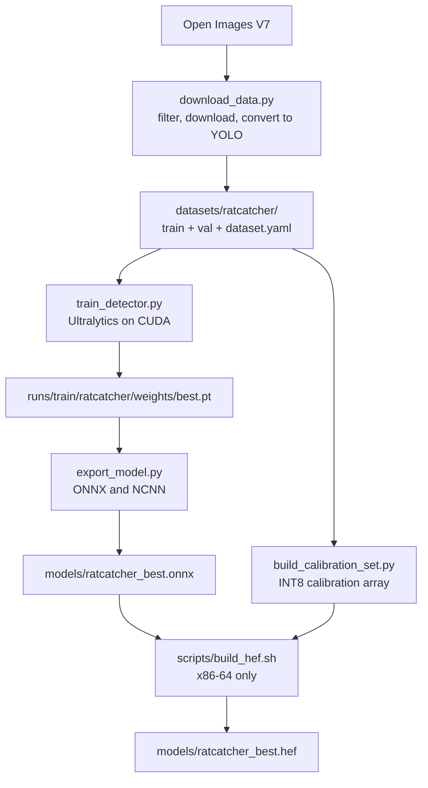

# RatCatcher AI -- Pest Detector Training

Train a custom YOLOv8n model. The model detects birds, squirrels, rats,
cats, and other animals at bird feeders. The training runs on a desktop
GPU (NVIDIA CUDA). The result goes to the Raspberry Pi 5.



## Prerequisites

- An NVIDIA GPU with CUDA support (8GB VRAM or more is better)
- CUDA toolkit 11.8 or 12.x
- Python 3.11 or a subsequent version
- Approximately 20GB of free disk space, for the dataset and the results

## Setup

```bash
# Make a training venv (different from the RPi deployment venv)
python3 -m venv .venv-training
source .venv-training/bin/activate

# Install PyTorch with CUDA (change cu121 to your CUDA version)
pip install torch torchvision --index-url https://download.pytorch.org/whl/cu121

# Install the training dependencies
pip install -r training/requirements.txt

# Make sure that CUDA operates
python -c "import torch; print(f'CUDA: {torch.cuda.is_available()}, GPU: {torch.cuda.get_device_name(0)}')"
```

## Step 1: Download the Training Data

This step downloads animal images with labels from Open Images V7 (a
Google dataset). No API keys are necessary.

```bash
# Download ~3000 images for each class (this gives good results)
python training/download_data.py --output datasets/ratcatcher --max-per-class 3000

# For a quick test (a smaller dataset, and faster)
python training/download_data.py --output datasets/ratcatcher --max-per-class 200
```

This downloads images with bounding boxes for these classes:
- **Bird** -- from the Open Images "Bird" label
- **Squirrel** -- from the Open Images "Squirrel" label
- **Rat** -- from the Open Images "Mouse" label (the shape is close)
- **Cat** -- from the Open Images "Cat" label
- **Unknown animal** -- from "Raccoon", "Rabbit" and "Skunk"

You can start the download again. It does not download an image that
it has.

The first run downloads a 2.2GB annotation CSV. It keeps that file for
subsequent runs.

## Step 2: Train

```bash
# Full training (~2-4 hours on an RTX 3080)
python training/train_detector.py --data datasets/ratcatcher/dataset.yaml --epochs 100

# Quick test (make sure that the setup operates)
python training/train_detector.py --data datasets/ratcatcher/dataset.yaml --epochs 5

# Continue training that stopped
python training/train_detector.py --data datasets/ratcatcher/dataset.yaml --resume
```

Training arguments:
- `--batch 32` -- increase the batch if you have the VRAM (default 16)
- `--imgsz 640` -- image dimensions (these must agree with the RPi inference)
- `--device 0` -- GPU device ID (default: automatic)
- `--patience 20` -- stop after this many epochs with no better result

Output: `runs/train/ratcatcher/weights/best.pt`

The training script prints the mAP, the precision and the recall for
each class.

## Step 3: Export for the Raspberry Pi

```bash
# Export to ONNX (for the OpenCV DNN backend)
python training/export_model.py --weights runs/train/ratcatcher/weights/best.pt

# Export to ONNX and NCNN
python training/export_model.py --weights runs/train/ratcatcher/weights/best.pt --formats onnx,ncnn
```

The output files go into `models/`. The script adds a `ratcatcher_`
prefix to the name of the weights file. Thus `best.pt` gives:
- `ratcatcher_best.onnx` -- for the OpenCV DNN backend
- `ratcatcher_ncnn/` -- for the NCNN backend

## Step 4: Deploy to the Raspberry Pi

```bash
# Copy the model to the RPi
scp models/ratcatcher_best.onnx pi@raspberrypi:/opt/ratcatcher/models/

# On the RPi, change the config
# Edit /opt/ratcatcher/config/default.yaml:
#   detection:
#     model_path: "ratcatcher_best.onnx"

# Start the service again
sudo systemctl restart ratcatcher
```

The detection backends find automatically if the model has 80 COCO
classes or 5 RatCatcher classes. They then use the correct class map.

### Hailo HEF Export

The NPU must have a HEF file. The Hailo Dataflow Compiler makes it, and
that compiler is an x86-64 Linux wheel (Python 3.8-3.11) with no
aarch64 build. Thus **you cannot make a HEF on the Pi**.

Do not use the plain `hailo parser`, `hailo optimize` and
`hailo compile` commands. They compile the Ultralytics decode tail onto
the NPU. The result builds with no error, but it wastes NPU resources
and it does not agree with what `HailoDetector` reads. Use this script:

```bash
# On an x86-64 Ubuntu machine, with the DFC in a venv:
PYTHON=./dfc-venv/bin/python HAILO_ARCH=hailo8l ./scripts/build_hef.sh
```

`scripts/build_hef.sh` stops immediately on aarch64. It runs
`training/build_calibration_set.py` to make the INT8 calibration array.
It then runs `training/build_hef.py` to compile. `build_hef.py` cuts the graph
at the six `model.22` head convolutions and attaches the decode and the
NMS as a HailoRT post-process. It also compiles the normalization into
the HEF. Refer to `docs/DEPLOYMENT.md` for the full procedure, and to
the comments at the top of `build_hef.py` for the full explanation.

## Training Data Classes

| YOLO ID | Class | Open Images Source | Notes |
|---|---|---|---|
| 0 | bird | Bird (/m/015p6) | Many images in OI |
| 1 | squirrel | Squirrel (/m/071qp) | Hundreds of images |
| 2 | rat | Mouse (/m/04rmv) | A close shape. OI has no rat label |
| 3 | cat | Cat (/m/01yrx) | Many images in OI |
| 4 | unknown_animal | Raccoon, Rabbit, Skunk | The catch-all pest class |

## Results

With 3000 images for each class and 100 epochs, these are the usual
results:
- Bird mAP@0.5: 0.70-0.85
- Cat mAP@0.5: 0.75-0.90
- Squirrel mAP@0.5: 0.50-0.70 (there are fewer training images)
- Overall mAP@0.5: 0.60-0.80

The model that this project uses gave mAP@0.5 = 0.751 on ~10K images.
More training data gives better numbers, and images from your own bird
feeder cameras give the best results.

## Add Your Own Training Data

To add your own images from the feeder cameras:

1. Put the images in `datasets/ratcatcher/train/images/`
2. Make YOLO label files with the same names in
   `datasets/ratcatcher/train/labels/`
3. Label format: `class_id x_center y_center width height`
   (normalized 0-1)
4. Train again

Tools that make labels: [Label Studio](https://labelstud.io/),
[CVAT](https://www.cvat.ai/), [Roboflow](https://roboflow.com/)

## Troubleshooting

**CUDA is out of memory:** decrease `--batch` (try 8 or 4).

**The download stops for a long time:** the train annotation CSV is
2.2 GB. Wait for the first download. Start the command again to
continue.

**Low mAP for squirrel or rat:** these classes have fewer training
images. Add more from your own cameras or from Roboflow datasets.

**The model finds nothing on the RPi:** make sure that
`config/default.yaml` has the correct `model_path`. Run
`ratcatcher health` to see the backends.
