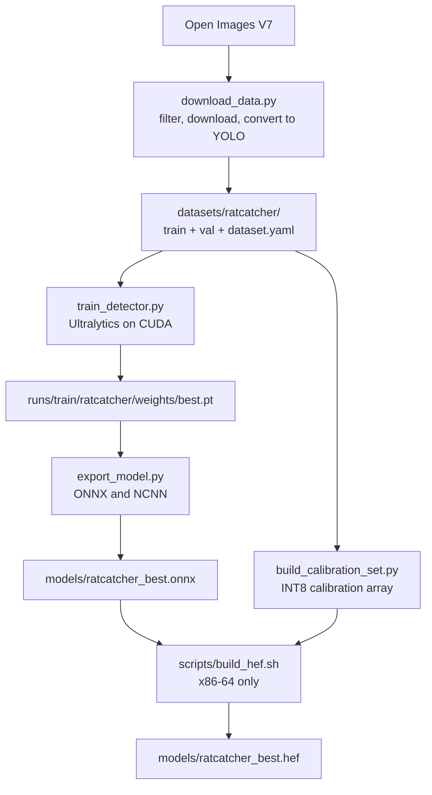

# RatCatcher AI -- Pest Detector Training

Train a custom YOLOv8n model. The model detects birds, squirrels, rats,
cats, and other animals at bird feeders. The training runs on a desktop
GPU (NVIDIA CUDA). The result goes to the Raspberry Pi 5.



## Prerequisites

- An NVIDIA GPU with CUDA support (8GB VRAM or more is better)
- CUDA toolkit 11.8 or 12.x
- Python 3.11 or a subsequent version
- Approximately 20GB of free disk space, for the dataset and the results

## Setup

```bash
# Make a training venv (different from the RPi deployment venv)
python3 -m venv .venv-training
source .venv-training/bin/activate

# Install PyTorch with CUDA (change cu121 to your CUDA version)
pip install torch torchvision --index-url https://download.pytorch.org/whl/cu121

# Install the training dependencies
pip install -r training/requirements.txt

# Make sure that CUDA operates
python -c "import torch; print(f'CUDA: {torch.cuda.is_available()}, GPU: {torch.cuda.get_device_name(0)}')"
```

## AMD ROCm setup

Training also operates on AMD. This project moved to a Ryzen AI MAX+ 395
(Radeon 8060S, `gfx1151`, RDNA3.5) on Ubuntu 26.04 with ROCm 7.1.1.
Install the ROCm build of PyTorch as an alternative to the CUDA build:

```bash
pip install --index-url https://download.pytorch.org/whl/rocm7.1 torch torchvision
```

Make the index agree with the ROCm version on the machine. Use
`apt-cache policy rocminfo` to find that version. On a ROCm build,
`torch.cuda` is the HIP API with its previous name. Thus
`train_detector.py` does not use a different code path.

**RDNA3.5 has one defect that you must correct by hand. Training cannot
start before you do it.** The PyTorch wheel contains its own copy of the
HSA runtime. That copy stops with a segmentation fault at the first
kernel launch on `gfx1151`. The process stops with no Python traceback.
Thus the fault looks like defective hardware.

The hardware is satisfactory. The system ROCm 7.1.1 runs `gfx1151`
kernels correctly. A small HIP test compiled with `hipcc` shows this.
Point PyTorch to the system runtime:

```bash
LIB=venv/lib/python3.*/site-packages/torch/lib
mv $LIB/libhsa-runtime64.so $LIB/libhsa-runtime64.so.bundled-broken
ln -s /usr/lib/x86_64-linux-gnu/libhsa-runtime64.so.1 $LIB/libhsa-runtime64.so
```

Do these steps again after each `pip install --upgrade torch`. An
upgrade installs the defective copy again. `training/rocm_compat.py`
cannot correct this fault, because the process stops in the kernel
launch before Python operates. The module finds the condition and shows
this instruction as an alternative.

The software corrects a second defect automatically. The MIOpen OpenCL
batchnorm kernel uses `row_bcast` DPP inline assembly. This is a GFX9
instruction, and RDNA3 does not have it. Thus each `batch_norm` call
gives `miopenStatusUnknownError`.

If you disable all of MIOpen, the convolutions become 6.4 times slower
(2.40 ms against 15.26 ms, measured on 16x64x160x160). Thus
`rocm_compat.py` sends only `batch_norm` around MIOpen. Convolution
continues to use MIOpen. The PyTorch batchnorm measures 1.70 ms, thus
there is no loss. `train_detector.py` applies this correction
automatically, and it does nothing on other devices.

MIOpen shows its `comgr` build failure one time at start. This occurs
because `rocm_compat` makes a test for the defect. The subsequent line
tells you if the software applied the correction.

To make sure that the GPU operates:

```bash
python -c "import torch; p=torch.cuda.get_device_properties(0); \
  print(torch.version.hip, p.name, p.gcnArchName)"
```

Measured on this machine: 13432 images at 640, batch 16, approximately
2.6 minutes for each epoch.

## Step 1: Download the Training Data

This step downloads animal images with labels from Open Images V7 (a
Google dataset). No API keys are necessary.

```bash
# Download ~3000 images for each class (this gives good results)
python training/download_data.py --output datasets/ratcatcher --max-per-class 3000

# For a quick test (a smaller dataset, and faster)
python training/download_data.py --output datasets/ratcatcher --max-per-class 200
```

This downloads images with bounding boxes for these classes:
- **Bird** -- from the Open Images "Bird" label
- **Squirrel** -- from the Open Images "Squirrel" label
- **Rat** -- from the Open Images "Mouse" label (the shape is close)
- **Cat** -- from the Open Images "Cat" label
- **Unknown animal** -- from "Raccoon", "Rabbit" and "Skunk"

You can start the download again. It does not download an image that
it has.

The first run downloads a 2.2GB annotation CSV. It keeps that file for
subsequent runs.

**Do not train on this set alone.** It has two properties that made the
deployed detector give incorrect detections for almost all of the
non-bird classes in the field. `docs/MODEL_TRAINING.md` measures the two
properties. First, the set has no background images. Second, the "Mouse"
substitution above puts pet hamsters in the class with the name "rat".
Step 1b corrects the two properties.

## Step 1b: Repair the Training Set

Three scripts, then a composition step. Run them in this sequence.

```bash
# Animal-free garden scenes. These become background images: present in
# train/images with an EMPTY .txt in train/labels. Fixes report 2.1.
python training/download_backgrounds.py --output datasets/backgrounds \
    --train 1500 --val 260

# Real wild Rattus from iNaturalist, replacing the hamsters. Fixes 2.2.
python training/download_rats.py --output datasets/rats --max 5500

# iNaturalist has no bounding boxes, so propose them with an
# open-vocabulary detector. --sheets writes a contact sheet to review.
python training/label_rats.py --input datasets/rats --sheets

# Compose the three sources into a new dataset. The original
# datasets/ratcatcher is left untouched so the two can be compared.
python training/build_dataset.py --output datasets/ratcatcher_v2
```

Measured result of that sequence:

| | before | after |
|---|---:|---:|
| train images | 9730 | 13432 |
| background images | 0 (0%) | 1500 (11.2%) |
| rat instances | 704 hamsters | 2925 wild rats |
| images discarded | -- | 658 hamster-only |

Learn these three points about the pipeline before you change it.

**The background images must show gardens. It is not sufficient that
they have no animal.** The first version of `download_backgrounds.py`
made its selection on Building, House, Window, Chair and Table together
with vegetation. A contact sheet of the result showed conference halls,
rooms in houses and street portraits. These images have no animal, but
they teach "no animal is here" for a scene that a garden camera does not
see.

The script makes vegetation necessary. It also rejects an image that has
an indoor marker. If you change that list, build a contact sheet and
examine it.

**The script discards a rat photograph that gets no box. It does not
keep the photograph as a background.** Each iNaturalist research-grade
observation has a rat in it. An empty label on such a photograph tells
the model that the photograph has no rat in it.

This teaches the model to reject the target that it must find. Thus
`label_rats.py` discards these photographs. The yield is approximately
59 percent.

**The boxes are proposals.** A person did not draw them. They come from
YOLO-World with the prompts "rat", "brown rat", "rodent" and "mouse".
Use `--sheets` and examine `datasets/rats/review/proposals.jpg` before
you train on them.

The iNaturalist images do **not** go into git. `.gitignore` excludes all
of `datasets/`. Most observations have a CC BY-NC licence. Its
NonCommercial condition applies to a commercial derivative of this
GPL-3.0 project. The BirdNET weights are external because of this same condition.

`datasets/rats/ATTRIBUTION.csv` keeps the observation id, the
photographer and the licence for each photograph. Each licence makes
attribution necessary, and you cannot get this data from the JPEG.

## Step 1c: Add Camera-Trap Frames

Step 1b gives wild rats. It does not give the deployment domain.
Measured on the iNaturalist set: 3.2 percent of the images are dark and
monochrome. 51.3 percent hold a rat that is taller than 35 percent of
the frame. 55.3 percent of the annotated observations have the mark
"dead".

The feeder camera sees a live rat at a distance of some metres, and at
night it sees in near-infrared.

The LILA BC camera-trap collections have that domain. The cameras do
not move, they change to infrared at night, and the study teams drew
the boxes. Run these two commands after Step 1b.

```bash
# Boxed camera-trap frames from LILA BC (Island Conservation by default).
# Also fetches verified empty frames from the same cameras: the nearest
# available hard negatives for a night-time IR scene. Fixes report 4.3
# in part. PROVENANCE.csv records the dataset, licence, camera and time
# of each image.
python training/download_camera_traps.py --output datasets/camera_traps

# Compose the four sources. The camera-trap frames divide by camera, not
# at random. One camera gives at most 300 frames, and a frame with more
# than three rats is dropped.
python training/build_dataset.py --output datasets/ratcatcher_v3
```

Measured result of that sequence, on the train images that hold a rat:

| | Step 1b (v2) | Step 1c (v3) |
|---|---:|---:|
| rat images | 2775 | 6019 |
| rat boxes | 2925 | 6624 |
| night, monochrome | 3.2% | 49.0% |
| night, colour | -- | 6.0% |
| day, monochrome | -- | 6.0% |
| median rat box height | 35.7% of frame | 17.6% of frame |
| cameras held out for val | -- | 27 of 116 |

Monochrome is a mean chroma below 8 and dark is a mean luma below 90.
These are the thresholds in `extract_rat_frames.py`. The feeder sees a
rat at approximately 17 percent of the frame height.

Learn these four points about this step before you change it.

**The script takes the full frame or none of it.** In the COCO Camera
Traps format, each animal in a frame has a box. If the script wrote only
the boxes for the five classes, a frame with a petrel would have no
label. That tells the model that a photograph of a bird holds no animal.
So the script maps each category to one of the five classes, and it
skips a frame that holds a category it cannot map. Two groups get a
different rule:

- The script keeps `human`, `insect`, `moth`, `spider` and the crabs in
  the frame without a box. This detector must not get a human class. A
  moth that crosses an 850 nm illuminator at night is the classic
  incorrect cause of a feeder alert. These frames are the only training
  signal that says that a moth is nothing.
- `unknown` and `eye_shine` make the script skip the frame. Two eyes in
  the dark are an animal that nobody can give a class.

**The division is by camera, and one camera has a cap.** A camera trap
fires a burst of frames seconds apart, at one background, on one
animal. A random train/val division puts near-identical frames on the
two sides, and the score then measures memorization. `build_dataset.py`
holds out full cameras. The script selects the held-out cameras by
their share of instances, not by their count of images.

One camera, `micronesia_cam06`, is a bait camera with 1,372 frames at
7.5 rats each, which is 64.8 percent of all rat instances.
`--camera-trap-cap` (default 300) limits it. `--max-rats-per-frame`
(default 3) drops the crowded frames: 1,055 frames hold 60.8 percent of
all rat instances, and the feeder sees one rat at a time.

**The v2 validation set cannot measure this step.** It holds no night
frame. On that set, v3 is the same as v2 (mAP@0.5 0.782 against 0.784).
On the 27 held-out cameras, the rat AP50 goes from 0.235 (v2) to 0.745
(v3). On the 938 night frames only, the rat AP50 goes from 0.279 to
0.759, and the incorrect detections on the 224 empty night frames go
from 5 to 3. Measure a change against the domain the change is for.

```bash
# Build the three evaluation sets from the camera-trap frames in the v3
# val split: eval_ct (all 1643 frames, 27 cameras), eval_ct_night (the
# 938 monochrome frames, infrared flash) and eval_ct_day (the 705 colour
# frames). Night is mean chroma below 8, the threshold that the
# composition table above uses. eval_ct/FRAMES.csv records the luma,
# chroma, set, box count and camera of each frame.
python training/build_eval_sets.py --dataset datasets/ratcatcher_v3

# Measure on the held-out cameras.
python training/evaluate_model.py --data datasets/eval_ct_night/dataset.yaml \
    --models runs/detect/runs/train/ratcatcher_v2/weights/best.pt \
             runs/detect/runs/train/ratcatcher_v3b/weights/best.pt
```

Night is a colour decision and not a clock decision. The camera clocks
in the LILA sets are not reliable: the hours of the night frames and
the day frames overlap almost fully. An infrared flash frame is
monochrome at each exposure, so mean chroma is the measurement that
divides them.

**Nothing in the set is thermal, and nothing must be.** The UC-517 is
an IMX477 behind an IR-cut switch. At night, with an illuminator, it
sees near-infrared. It does not see a thermal image. Thermal training
data would teach a domain that the camera cannot make.

The camera-trap sets have the CDLA-Permissive 1.0 licence, which lets
you use and redistribute the data. The images do **not** go into git:
`.gitignore` does not include `datasets/`.

Two limits stay. Some boxes from the study teams are loose, and I
examined the labels on a contact sheet, not by hand. And the Pi has no
illuminator, so there is no night footage of this yard. The
measurements above come from the cameras of other study teams.

## Step 2: Train

```bash
# Full training (~2-4 hours on an RTX 3080)
python training/train_detector.py --data datasets/ratcatcher/dataset.yaml --epochs 100

# Quick test (make sure that the setup operates)
python training/train_detector.py --data datasets/ratcatcher/dataset.yaml --epochs 5

# Continue training that stopped
python training/train_detector.py --data datasets/ratcatcher/dataset.yaml --resume
```

Training arguments:
- `--batch 32` -- increase the batch if you have the VRAM (default 16)
- `--imgsz 640` -- image dimensions (these must agree with the RPi inference)
- `--device 0` -- GPU device ID (default: automatic)
- `--patience 20` -- stop after this many epochs with no better result

Output: `runs/train/ratcatcher/weights/best.pt`

The training script prints the mAP, the precision and the recall for
each class.

## Step 3: Export for the Raspberry Pi

```bash
# Export to ONNX (for the OpenCV DNN backend)
python training/export_model.py --weights runs/train/ratcatcher/weights/best.pt

# Export to ONNX and NCNN
python training/export_model.py --weights runs/train/ratcatcher/weights/best.pt --formats onnx,ncnn
```

The output files go into `models/`. The script adds a `ratcatcher_`
prefix to the name of the weights file. Thus `best.pt` gives:
- `ratcatcher_best.onnx` -- for the OpenCV DNN backend
- `ratcatcher_ncnn/` -- for the NCNN backend

## Step 4: Deploy to the Raspberry Pi

```bash
# Copy the model to the RPi
scp models/ratcatcher_best.onnx pi@raspberrypi:/opt/ratcatcher/models/

# On the RPi, change the config
# Edit /opt/ratcatcher/config/default.yaml:
#   detection:
#     model_path: "ratcatcher_best.onnx"

# Start the service again
sudo systemctl restart ratcatcher
```

The detection backends find automatically if the model has 80 COCO
classes or 5 RatCatcher classes. They then use the correct class map.

### Hailo HEF Export

The NPU must have a HEF file. The Hailo Dataflow Compiler makes it, and
that compiler is an x86-64 Linux wheel (Python 3.8-3.11) with no
aarch64 build. Thus **you cannot make a HEF on the Pi**.

Do not use the plain `hailo parser`, `hailo optimize` and
`hailo compile` commands. They compile the Ultralytics decode tail onto
the NPU. The result builds with no error, but it wastes NPU resources
and it does not agree with what `HailoDetector` reads. Use this script:

```bash
# On an x86-64 Ubuntu machine, with the DFC in a venv. The DFC venv has
# no OpenCV, so make the calibration set with the training venv first.
# Sample it from the v3 train split, so the quantizer sees infrared
# night frames: 60 of these 256 frames are monochrome.
venv/bin/python3 training/build_calibration_set.py \
    --images datasets/ratcatcher_v3/train/images \
    --output models/v3/calibration_set.npy --count 256

# Compile for the Hailo-8 on this Pi. HAR keeps the quantized archive,
# which the next command needs.
PYTHON=./dfc-venv/bin/python HAILO_ARCH=hailo8 \
    ONNX=models/v3/ratcatcher_best.onnx \
    CALIB=models/v3/calibration_set.npy \
    OUTPUT=models/v3/ratcatcher_best.hef \
    HAR=models/v3/ratcatcher_best_quantized.har \
    ./scripts/build_hef.sh

# Measure the INT8 cost without an NPU. The DFC runs the quantized graph
# on the CPU; this runs it and the ONNX on the same frames with the same
# decode and the same scoring code. About 0.5 s per frame at batch 16.
dfc-venv/bin/python training/compare_hef_accuracy.py \
    --onnx models/v3/ratcatcher_best.onnx \
    --har models/v3/ratcatcher_best_quantized.har \
    --data datasets/eval_ct_night --limit 0
```

Measured on 2026-09-17, v3 detector, all 938 night frames, score
floor 0.2 for the two models (the HEF's compiled NMS floor):

| | ONNX (float) | HAR (INT8) | cost |
|---|---:|---:|---:|
| rat AP50 | 0.658 | 0.622 | -0.036 |
| cat AP50 | 0.727 | 0.649 | -0.078 |
| rat precision at conf 0.45 | 0.882 | 0.832 | -0.050 |
| rat recall at conf 0.45 | 0.577 | 0.572 | -0.005 |
| empty frames with a detection | 0 of 224 | 1 of 224 | +1 |

Do not compare these AP values with the Ultralytics values above. This
script cuts the two models at 0.2 and uses VOC interpolation, so its
values are lower for the same model. Compare the two columns with each
other only.

The recall at the deployment threshold is the same. The cost is in
precision: INT8 adds 15 incorrect rat boxes in 938 frames. A larger
calibration set (`--count 1024`, the Model Zoo value) is the first
thing to try if that cost is too high.

`scripts/build_hef.sh` stops immediately on aarch64. It runs
`training/build_calibration_set.py` to make the INT8 calibration array.
It then runs `training/build_hef.py` to compile. `build_hef.py` cuts the graph
at the six `model.22` head convolutions and attaches the decode and the
NMS as a HailoRT post-process. It also compiles the normalization into
the HEF. Refer to `docs/DEPLOYMENT.md` for the full procedure, and to
the comments at the top of `build_hef.py` for the full explanation.

On the Pi, `hailortcli parse-hef models/ratcatcher_best.hef` must report
5 classes, not 80. This machine has no HailoRT, so that check is not
made here.

## Training Data Classes

| YOLO ID | Class | Open Images Source | Notes |
|---|---|---|---|
| 0 | bird | Bird (/m/015p6) | Many images in OI |
| 1 | squirrel | Squirrel (/m/071qp) | Hundreds of images |
| 2 | rat | iNaturalist *Rattus* and LILA BC camera traps | OI has no rat label. Its Mouse class (/m/04rmv) is pet hamsters and is dropped |
| 3 | cat | Cat (/m/01yrx) | Many images in OI |
| 4 | unknown_animal | Raccoon, Rabbit, Skunk | The catch-all pest class |

## Results

With 3000 images for each class and 100 epochs, these are the usual
results:
- Bird mAP@0.5: 0.70-0.85
- Cat mAP@0.5: 0.75-0.90
- Squirrel mAP@0.5: 0.50-0.70 (there are fewer training images)
- Overall mAP@0.5: 0.60-0.80

The model that this project uses gave mAP@0.5 = 0.751 on ~10K images.
The v3 model (Step 1c) gave mAP@0.5 = 0.760 on its own val set, and
rat AP50 0.745 on 27 camera-trap locations that it did not train on.
More training data gives better numbers, and images from your own bird
feeder cameras give the best results.

## Add Your Own Training Data

To add your own images from the feeder cameras:

1. Put the images in `datasets/ratcatcher/train/images/`
2. Make YOLO label files with the same names in
   `datasets/ratcatcher/train/labels/`
3. Label format: `class_id x_center y_center width height`
   (normalized 0-1)
4. Train again

Tools that make labels: [Label Studio](https://labelstud.io/),
[CVAT](https://www.cvat.ai/), [Roboflow](https://roboflow.com/)

## Troubleshooting

**CUDA is out of memory:** decrease `--batch` (try 8 or 4).

**The download stops for a long time:** the train annotation CSV is
2.2 GB. Wait for the first download. Start the command again to
continue.

**Low mAP for squirrel or rat:** these classes have fewer training
images. Add more from your own cameras or from Roboflow datasets.

**The model finds nothing on the RPi:** make sure that
`config/default.yaml` has the correct `model_path`. Run
`ratcatcher health` to see the backends.
